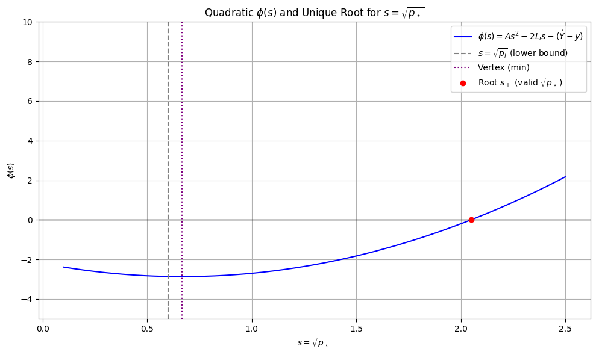

# Compensation Price Calculation

(Diagram: Visualization of solution for effective compensation price)

This note explains how the compensation price is determined when the price lies within the swap price range $p_\star \in [p_l, p_u]$.
## Variables & Definitions

- $ L_i > 0$: virtual liquidity for range $i$ ($L_i = \sqrt{x_i y_i}$ where $x_i, y_i$ are the virtual reserves for range $i$)
- $p_{i} > 0$ is the price of the lower boundary of range $i$
- $p_\star > 0$: post-trade effective compensation price
- $B > 0$ is the bid/liquidity compensation amount.
- Given some liquidity $L_i$ and a price $p$ we can determine the virtual reserves in $x$ & $y$ at that price point with: $x = L_i\cdot\frac{1}{\sqrt p}, y = L_i\cdot{\sqrt p}$
- To compute the net amount deltas required to cross a range $i$: $\Delta x_i =L_i(\frac{1}{\sqrt{p_i}}-\frac{1}{\sqrt{p_{i+1}}}),\ \Delta y_i = L_i(\sqrt{p_{i+1}}-\sqrt{p_i})$
- $\hat X, \hat Y > 0$: aggregated swap amount of whole ranges where the final $p_\star \notin [a_i, b_i]$ is known to lie outside of (where $a_i = \max\{p_i, p_{\text{start}}\}, b_i = \min\{p_{i+1}, p_{\text{end}}\}$, implicitly $a_i \le b_i$):
 
$$\hat X =\sum_i L_i(\frac{1}{\sqrt{a_i}}-\frac{1}{\sqrt{b_i}}),\qquad \hat Y = \sum_i L_i(\sqrt{b_i}-\sqrt{a_i}).$$

## Compensation Price definition

Assuming unsigned total deltas $X = \sum_i {\Delta x_i}, Y=\sum_i \Delta y_i$ the final compensation price $p_\star$ is defined as:

**Zero-for-One Swap:** $p_\star = \frac{Y}{X + B}$ such that each range $i$ trades $\Delta x'_i = \Delta y_i \cdot (\min \{p_\star, \frac{\Delta y_i}{\Delta x_i}\})^{-1}$

**One-for-Zero Swap:** $p_\star = \frac{Y}{X- B}$ such that each range $i$ trades $\Delta x'_i = \Delta y_i \cdot (\max \{p_\star, \frac{\Delta y_i}{\Delta x_i}\})^{-1}$

## Base Considered Swap Amount

Notice from the above definition that there will be a consecutive sub-set of ranges which will trade at ($p_\star \le \frac{\Delta y_i}{\Delta x_i}$ for zero-for-one, $p_\star \ge \frac{\Delta y_i}{\Delta x_i}$ for one-for-zero).

This range can be determined by walking from $p_{start} \rightarrow p_{end}$ and keeping track of the total sum so far $\hat X = \sum_i {\Delta x_i},\hat Y=\sum_i \Delta y_i$. At each step checking $\tilde p_i = \frac{\hat Y}{\hat X + B}/\tilde p_i = \frac{\hat Y}{\hat X - B} $ depending on the swap direction. If $\tilde p_i$ is outside of the current range the current range will be part of the consecutive set.

If all ranges are depleted and $\tilde p_{end}$ lies beyond $p_{end}$ then we can take $p_\star := \tilde p_{end}$.

Otherwise when a range is found such that $\tilde p_i \in [p_i, p_{i+1}]$ we need to calculate the actual $p_\star$ that satisfies our original formula.

## Zero-for-One (price decreasing)

### Setup
For a given tick $i$ that is being swapped through, we have:

$$\Delta x = L\left(\frac{1}{\sqrt{p_\star}}-\frac{1}{\sqrt{p_{i+1}}}\right),\qquad
\Delta y = L\cdot(\sqrt{p_{i+1}}-\sqrt{p_\star}),\qquad
B = \frac{\hat Y+\Delta y}{p_\star} - (\hat X+\Delta x).
$$

### Quadratic in $\sqrt{p_\star}$

Clearing denominators and simplifying yields:

$$ A \cdot(\sqrt{p_\star})^2 + 2L\cdot\sqrt{p_\star} - (\hat Y+y) = 0,\qquad A := B + \hat X - x $$

Solutions:

$$\sqrt{p_\star}=\frac{-L \pm \sqrt{L^2 + A(\hat Y+y)}}{A}
=\frac{-L \pm \sqrt{\hat Y\cdot(B+\hat X - x)+ y\cdot(B+\hat X)}}{B+\hat X - x}.$$

(The two radicands are equal because $L^2=xy$.)

### Existence & Uniqueness on $(0,u]$ (where $u=\sqrt{p_{i+1}}$)

The quadratic gives us two solutions, we now want to prove the theorem that:
> There exists one unique solution that lies in the range $(0, u]$ and that solution is given by:
> $$s_+ = \frac{-L + \sqrt{L^2 + A(\hat Y+y)}}{A}$$

Let's take the above quadratic as a function $\phi(s)$ s.t. $\phi(\sqrt{p_\star}) = 0$:

$$\phi(s) =A s^2 + 2Ls - (\hat Y+y)$$

### Lemma 1: Monotonicity of $\phi(s)$ over $(0,u]$

We prove that $\phi(s)$ monotonically increases for $s \in (0, u]$ by showing that $\phi'(s) \ge 0$ in that range:

$\phi'(s) = 2As + 2L$

**$\phi'(0) \ge 0$:** $\phi'(0) = 2A(0) + 2L = 2L \Rightarrow \phi'(0) \ge 0$

**$\phi'(u) \ge 0$:**
- Expand $\phi'(u)$: $2Au + 2L \ge 0 \Leftrightarrow 2 (B + \tilde X - x)u \ge -2L$
- Prove tighter bound: $B + \tilde X - x \ge -x \Rightarrow 2(-x)u \ge -2L \Rightarrow 2Au \ge -2L$
- Use $u = \sqrt\frac{y}{x}$:$\quad 2 (-x)\sqrt{\frac{y}{x}} \ge -2\sqrt{xy} \Leftrightarrow x\sqrt\frac{y}{x} \le \sqrt{xy} \Leftrightarrow \sqrt{x^2 \frac{y}{x}}  = \sqrt{xy} $

### Lemma 2: Boundary signs $\phi(0) < 0$ and $\phi(u) \ge 0$

$\phi(0) \lt 0$: $ - (\tilde Y + y) < 0 $
$\phi(u) \ge 0$:
- Expand $\phi(u)$: $Au^2+2Lu-(\tilde Y + y) \ge 0$
- Expand $A$ and simplify: $ (B + \hat X - x)u^2+2y-\tilde Y - y \ge 0 \Leftrightarrow (B + \tilde X)u^2  \ge 
\tilde Y$
- Reorganize & expand $u^2$: $p_{i+1} \ge \frac{\tilde Y}{B + \tilde X}$
- Recognize that $\tilde p = \frac{\tilde Y}{B + \tilde X}$ and that $p_{i+1} \ge \tilde p$ is the precondition for beginning this calculation

### Lemma 3: Unique Solution in $(0,u]$

Using Lemma 1 & 2 and the Intermediate value theorem we now know that there is exactly one $s \in (0,u]$ s.t. $\phi(s) = 0$ and therefore only one solution to the quadratic in that range.

### Lemma 4: $s_+$ is that solution

$$s_+ = \frac{-L + \sqrt{D}}{A}, D:=L^2 + A(\hat Y+y)$$
$$s_- = \frac{-L - \sqrt{D}}{A}$$

**$A > 0$:** trivially $s_- < 0$, leaving $s_+$ as the only positive solution.

**$A < 0$:**

When $A < 0$ then $\sqrt D < L$. This leads to both $s_+$ and $s_-$ being positive. However in this case we can show that:

$$s_+ < s_-$$
$$\frac{-L + \sqrt{D}}{A} < \frac{-L - \sqrt{D}}{A}$$
$$-L + \sqrt{D} > -L - \sqrt{D}$$
$$\sqrt{D} > - \sqrt{D}$$

### All together

Together we've shown that there is always a positive solution for $\sqrt {p_\star}$ that lies between $0$ and $\sqrt{p_{i+1}}$ and that it's calculated via the positive solution from the quadratic.

## One-for-Zero (price increasing)
For a given tick $i$ that is being swapped through, we have:

$$\Delta x = L\left(\frac{1}{\sqrt{p_i}}-\frac{1}{\sqrt{p_\star}}\right),\qquad
\Delta y = L\cdot(\sqrt{p_\star}-\sqrt{p_i}),\qquad
B = \frac{\hat Y+\Delta y}{p_\star} - (\hat X+\Delta x).
$$1

### Quadratic in $\sqrt{p_\star}$

Clearing denominators, substituting $A := \tilde X + x -B, s =\sqrt{p_\star} $ simplifying yields:

$$ As^2−2L​s−(\tilde Y−y) = 0$$

Solutions:

$$\sqrt{p_\star}=\frac{L \pm \sqrt{L^2 + A(\hat Y-y)}}{A}
=\frac{L \pm \sqrt{\hat Y\cdot(x+\hat X - B)-  y\cdot(\hat X - B)}}{x+\hat X - B}.$$

### Lemma 1: Monotonicity in range $[l, +\infty)$ (where $l = \sqrt{p_i}$)

$$\phi'(s) = 2As - 2L$$
$$\phi'(s) \ge 0 \Leftrightarrow s \ge \frac{L}{A}$$

We'll call the point $ \frac L A$ at which $\phi(s)$ becomes monotonically increasing $s_0$ it may or may not lie in the range $[l, +geinfty)$

### Lemma 2: Negative Lower Range Bound $\phi(s_0) \le 0$

$$\phi(s_0) \le 0$$
$$ A(\frac{L}{A})^2−2L​(\frac{L}{A})−(\tilde Y−y) \le 0$$
$$ -\frac {L^2} A −(\tilde Y−y) \le 0$$
$$ -\frac {L^2} A  \le (\tilde Y−y)$$
$$ - {L^2} \le (\tilde Y−y) A$$
$$ - {L^2} \le \tilde Y A − y (\tilde X - B) - yx$$
$$ 0 \le \tilde Y A − y (\tilde X - B)$$
$$ y (\tilde X - B) \le \tilde Y A  $$

$\tilde X - B < 0$:
- Reorganize into fractions: $\frac y A \ge \frac {\tilde Y}{\tilde X - B}$
- Trivially true because $y > 0, A > 0, \tilde Y > 0$

$\tilde X - B > 0$
- Reorganize into fractions: $\frac y {x + (\tilde X - B)} \le \frac {\tilde Y}{\tilde X - B}$
- Tighten inequality: $\frac y x \le \frac {\tilde Y}{\tilde X - B}$
- Trivially true as it's the pre-condition to the computation

### Lemma 3: Unique solution in $[s_0, +\infty)$
Using the above lemmas together with a intermediate value theorem we now know that there is a unique solution in this range.

### Lemma 4: $s_+ \in [s_0, +\infty)$
$$s_+=\frac{L + \sqrt{D}}{A}, D:=L^2 + A(\hat Y-y)$$
$$s_-=\frac{L - \sqrt{D}}{A}$$

When $\hat Y-y \ge 0$:
- $A(\tilde Y - y) \ge 0 \Rightarrow D \ge L^2 \Rightarrow \sqrt D \ge L$ 
- Trivially: $s_- < 0$ leaving $s_+$ as the only positive solution.

When $\hat Y-y \lt 0$:
- $\sqrt D \lt L$ following the above reasoning, meaning both $s_+$ and $ s_-$ are positive
- However we can trivially see that $s_+ > s_-$
- Because exactly one solution must lie in $[s_0, +\infty)$ it must be $s_+$ because if it were $s_-$ it would lead to a contradiction requiring $s_+ > s_-$ but also $s_+ \notin [s_0, +\infty)$.

### Lemma 5: $s_+ \ge l$

$$\frac{L + \sqrt{D}}{A} \ge l$$
$${L + \sqrt{D}} \ge l (x + \tilde X - B)$$
$${L + \sqrt{D}} \ge L +l (\tilde X - B)$$
$$\sqrt{D} \ge l (\tilde X - B)$$

When $\tilde X - B < 0$: Inequality true because left side is positive and left side negative.

When $\tilde X -B \ge 0$:

$$D \ge p_i (\tilde X - B)^2$$
$$L^2 + A (\tilde Y - y) \ge p_i (\tilde X - B)^2$$
$$L^2 + A \tilde Y - y x - y(\tilde X - B) \ge p_i (\tilde X - B)^2$$
$$A \tilde Y - y(\tilde X - B) \ge p_i (\tilde X - B)^2$$
$$A \tilde Y \ge p_i (\tilde X - B)^2 + y(\tilde X - B)$$
$$A \tilde Y \ge p_i (\tilde X - B)^2 + p_i x(\tilde X - B)$$
$$A \tilde Y \ge p_i \cdot(\tilde X - B)\cdot((\tilde X - B) + x)$$
$$A \tilde Y \ge p_i \cdot(\tilde X - B)\cdot((\tilde X - B) + x)$$
$$\frac{ \tilde Y}{\tilde X - B} \ge p_i \cdot 1$$
$$\tilde p \ge p_i $$

This is the precondition for the calculation which makes our lemma $s_+ \ge l$ true!

### Final Proposition

Thanks to lemmas 3-5 we have now proven the required facts to know that $s_+$ gives us the unique $\sqrt{p_\star}$.